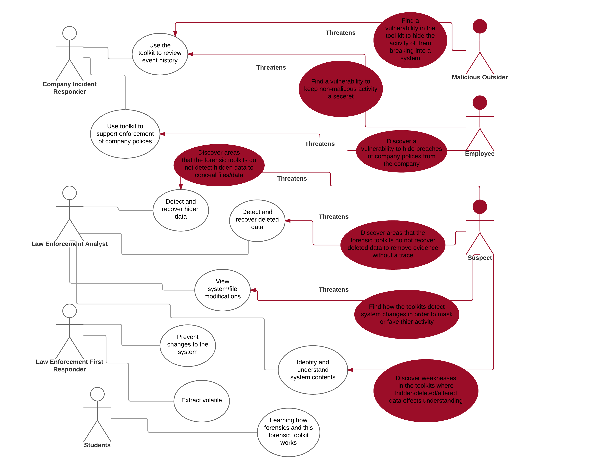

# Anti-Forensics

#### Table of Contents
- [Executive Project Summary](#executive-project-summary)
- [Proposed Project Timeline](#proposed-project-timeline)
- [Project-Oriented Risk List](#project-oriented-risk-list)
- [Application Requirements](#application-requirements)
- [Resources Needed](#resources-needed)

### Executive Project Summary

An enormous amount of data from interconnected devices has set a new era of issues that law enforcement has to find solutions for. Since humans are so reliant on using this technology, it comes to no surprise that many people are using this powerful technology to commit crimes. Thus law enforcement are often tasked with collecting digital evidence that is admissible in the court of law.

Given that law enforcement wants to collect and use digital evidence in court to aid in the identification and conviction of criminals, there will be criminals and people out there who will want to thwart this collection process. Thus the concept of anti-forensics is introduced. Through anti-forensics, wrong-doers aim to derail investigations by reducing not only the quality, but also the quantity of data that may be used as digital evidence. Through this, the investigation may provide little insight into the act committed, allowing the offending party to escape the consequences of their actions.

The goal of our research is to generate a report that shows the strengths and weaknesses of widely used forensics toolkits. This research will be broken down into sections of: researching Anti-forensics tools for data hiding, data alteration, and data destruction, popular all-in-one forensics toolkits, and researching documentation strategies for evaluating these forensics toolkits.

Then, the research will move to building a virtual machine that has these tools and techniques used on the virtual machine, conducting forensic investigations with the forensic toolkits, and writing reports on the results.

After this project concludes, law enforcement, incident response, and digital forensic analysts will have a better understanding of the capabilities of these forensic toolkits. Also, this will be an overarching resource for developers to see where the strengths and weaknesses lie in their applications. Finally, this could show these professionals the weaknesses or shortcomings of the forensic toolkits that they could be using, which could lead to more complete toolkits being used or created.

### Proposed Project Timeline

### Project-Oriented Risk List

| Risk name (value) | Impact | Likelihood | Description |
|-|-|-|-|
| Can't find appropriate tools (25) |  5 | 5 | Tools do not exist or cannot be obtained to perform intended anti-forensic techniques. |
| Loss of team member (20) | 10 | 2 | An unexpected incident prevents a team member from contributing during the time of this study.|
| Tools don't work on VM (16) | 8 | 2 | Tools do not perform required functions when executed in a virtual environment. |
| Can't perform all of the techniques being explored (16) | 8 | 2 | Support does not exist within a virtual environment to apply all anti-forensic techniques.|
| Lost progress due to system crash (10) | 5 | 2 | Repeated loss of progress during the execution of forensic toolkits would greatly extend the time needed to perform the analysis of the generated VMs. |

### Application Requirements

##### User Story 1.
As a **Computer Forensic Analyst**, I want to **detect and recover hidden data** so I can **spot trails of evidence**
AC 1.1: Using the digital forensics tool, the location of data hidden within the context of the system can be identified.
AC 1.2: Using the digital forensics tool is able to recover data hidden within a given location.

##### User Story 2.
As a **Computer Forensic Analyst**, I want to **detect and recover deleted data** so I can **support/define a suspect's intent**
AC 2.1: The digital forensics tool is able to detect all files whose pointers have been deleted and have not been completely overwritten in the file system.
AC 2.2: The digital forensics tool is able to recover all portions of a file that have not been overwritten in the file system.

##### User Story 3.
As a **Computer Forensic Analyst**, I want to **detect system modifications** so I can **construct a timeline of actions taken**
AC 3.1: The digital forensics tool is able to detect changes to system logs
AC 3.2: The digital forensics tool is able to detect changes to file attributes
AC 3.3: The digital forensics tool is able to detect changes to the registry

##### User Story 4.
As a **Member of a Computer Incident Response Team**, I want to **view previous activity on a system** so I can **restore the system's availability**
AC 4.1: The digital forensics tool is able to retrieve system logs

##### User Story 5. 
As a **Member of a Computer Incident Response Team**, I want to **audit actions taken internally** so I can **verify employee compliance with company policies**
AC 5.1: The digital forensics tool is able to retrieve system logs

#### Use Case Diagram

### Resources/Technology Needed

|Resource  | Dr. Hale needed? | Investigating Team member | Description |
|-|-|-|-|
| SANS Investigative Forensics Toolkit - SIFT | No | Casey | Target Forensics Toolkit |
| FTK | No | Brandon | Target Forensics Toolkit |
| Sleuth Kit | No | Preston | Target Forensics Toolkit |
| X-Ways Forensics | No | Preston | Optional Target Forensics Toolkit |
| Virtual Box | No | Brandon | Virtualization Environment for Evaluating Forensic Toolkits |
| Windows 7 ISO | No | Casey | Operating System used for Virtualized Environment |
